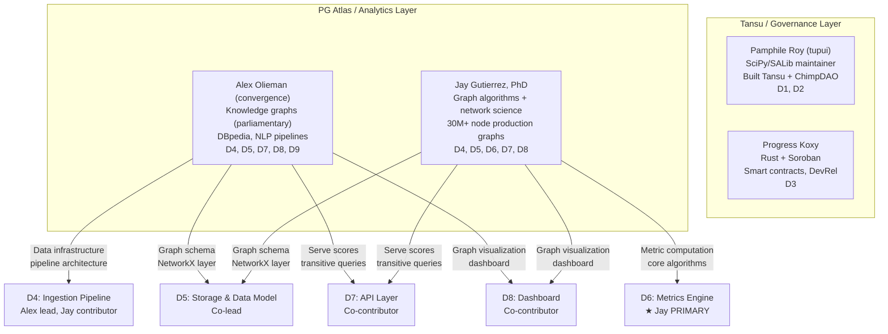
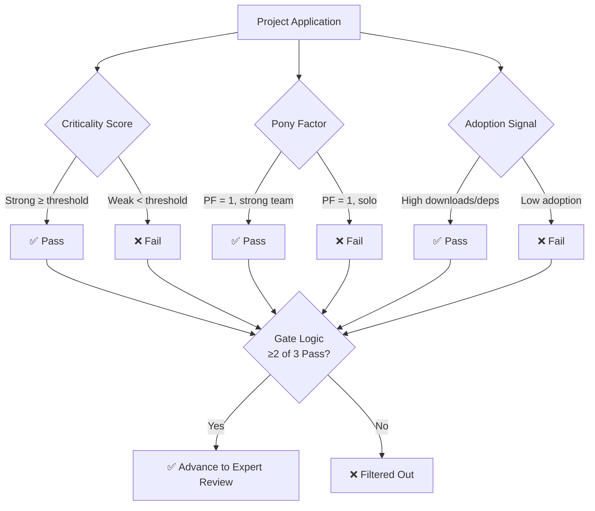
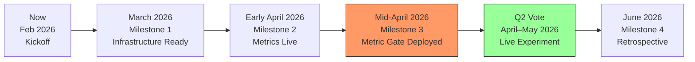
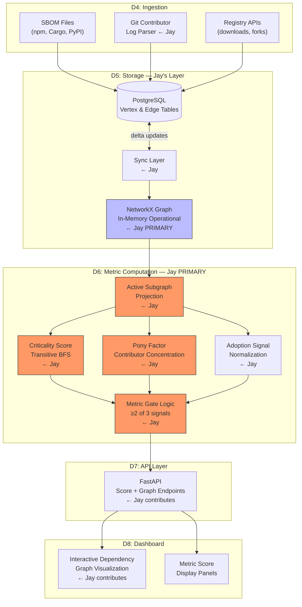

# PG Atlas — Jay Gutierrez: Role, Deliverables & Scope
**Deep Systems Analysis** | February 2026

---

## Triage Assessment

| Axis | Score | Rationale |
|---|---|---|
| **Stakes** | 4/5 | Funded Q2 experiment, public reputation, real decision-making infrastructure |
| **Uncertainty** | 3/5 | Project is well-scoped technically; Jay's exact role boundaries not formally assigned |
| **Complexity** | 4/5 | Multi-domain: graph algorithms + governance + open-source analytics + team coordination |
| **Composite** | **11/15 → Maximum Mode** | All phases, full depth |

---

## Part I: Project Context — What PG Atlas Actually Is

### The Problem it Solves

The Stellar Community Fund's Public Goods Award has funded open-source tools, libraries, and infrastructure in the Stellar/Soroban ecosystem. The problem: funding decisions have relied on noisy, subjective signals. Which packages are actually critical to the ecosystem? Which are maintained by a single person who could disappear tomorrow? Which are actively evolving vs. dormant?

PG Atlas is the answer. It is an **objective, graph-derived metrics backbone** that provides transparent, verifiable signals for funding decisions. It is not a voting mechanism or governance system — it is the data layer underneath governance.

### The Broader Experiment Architecture

The Q2 2026 proposal introduces a three-layer decision stack for public goods maintenance funding:

```
┌─────────────────────────────────────────────────────┐
│  Layer 1: METRIC GATE (objective filter)             │
│  → PG Atlas scores determine which projects advance  │
├─────────────────────────────────────────────────────┤
│  Layer 2: EXPERT REVIEW (qualitative depth)          │
│  → SCF Pilots review using PG Atlas data as context  │
├─────────────────────────────────────────────────────┤
│  Layer 3: NQG COMMUNITY VOTE (legitimacy signal)     │
│  → Voters see PG Atlas metrics alongside proposals   │
└─────────────────────────────────────────────────────┘
```

PG Atlas powers Layer 1 and enriches Layers 2 and 3. Without it, the experiment has no objective foundation.

### The Nine Deliverables

| ID | Deliverable | System | Primary Owner |
|---|---|---|---|
| D1 | SCF Governance Space (Tansu) | Tansu | Pamphile Roy |
| D2 | NQG Score Integration (Tansu) | Tansu | Pamphile Roy |
| D3 | NQG Soulbound NFT (SEP-50) | Tansu/Chain | Progress (Koxy) |
| **D4** | **Data Ingestion Pipeline** | **PG Atlas** | **Alex + Jay** |
| **D5** | **Storage & Data Model** | **PG Atlas** | **Alex + Jay** |
| **D6** | **Metric Computation Engine** | **PG Atlas** | **Jay (PRIMARY)** |
| **D7** | **API Layer** | **PG Atlas** | **Alex + Jay** |
| **D8** | **Public Dashboard** | **PG Atlas** | **Alex + Jay** |
| D9 | Deployment & Operations | PG Atlas | All / Ops |

**Jay owns the analytic heart of PG Atlas.** D6 is where network science lives. Everything else serves it or consumes it.

---

## Part II: Jay's Natural Role — Graph Analytics & Network Science Lead

### The Structural Match

Jay's expertise maps to PG Atlas with near-perfect alignment. PG Atlas needs exactly the methods he has already applied at scale in different domains:

| PG Atlas Concept | Jay's Equivalent System | Jay's Method |
|---|---|---|
| **Dependency graph** | Trophic network / knowledge graph (30M+ nodes) | NetworkX, Neo4j, igraph |
| **Criticality score** | Reef condition score (NRSI) — translating topology to grade | Transitive cascade modeling |
| **Pony factor** | Species abundance concentration — who bears the load | k-core decomposition |
| **Active subgraph projection** | Active trophic pathways — pruning dormant nodes | BFS with activity filter |
| **Metric gate → funding decision** | Bond rating → investment eligibility (MARIS AAA–CCC) | Risk quantification |
| **SBOM ingestion** | eDNA metabarcoding ingestion | Pipeline architecture |
| **Adoption signal normalization** | Ecosystem service flow normalization | Statistical normalization |

**The pattern is identical.** PG Atlas is MARIS applied to open-source software — encode domain topology, compute structural metrics, translate to decision-grade scores, serve as funding signal. Jay has been building this exact architecture. He's just done it for reefs and capital markets.

### The Team Dynamic

The four pilots bring distinct non-overlapping strengths:



**Jay and Alex are the natural PG Atlas co-leads.** Alex brings data pipeline and knowledge graph infrastructure depth (DBpedia, parliamentary data systems). Jay brings network analytics algorithm depth (k-core, BFS, centrality, cascade modeling). The cleanest split: Alex owns the data in/out; Jay owns the computation layer in the middle.

---

## Part III: Deliverable-Level Scope (Jay's Work)

### D6 — Metric Computation Engine (PRIMARY OWNER) ★

This is Jay's core deliverable. It takes the dependency graph from storage and computes three families of metrics:

**Family 1: Active Subgraph Projection**

The raw dependency graph contains many dormant projects. Before any scoring, project nodes must be classified as active or inactive.

- **Active**: ≥1 release in the last 90 days OR ≥1 commit in the last 90 days OR repository not archived
- **Algorithm**: Filter vertex set → retain only active nodes → rebuild induced subgraph
- **Output**: `active_subgraph` — the operational network used for all downstream scoring

```
Input: G(V, E) — full dependency graph
Filter: v ∈ V_active iff activity_signal(v) == true
Output: G_active(V_active, E_induced)
```

**Family 2: Criticality Score (Transitive Active Dependents)**

This is the flagship metric. A package is critical not because many people directly depend on it, but because many active packages transitively depend on it — and removing it would cascade.

- **Algorithm**: BFS on reversed dependency graph from each active leaf node
- **Output**: `criticality_score(v)` = count of active packages reachable from v in reversed graph
- **Network science mapping**: This is a reachability/influence metric — equivalent to counting the nodes downstream of v in a DAG
- **Jay's edge**: He has built cascade models over 20M+ trophic relationships. A transitive dependent BFS over a software dependency graph is simpler than trophic cascade modeling.

```python
# Pseudocode for Jay's reference
def criticality_score(G_active, v):
    G_rev = G_active.reverse()
    reachable = nx.descendants(G_rev, v)
    active_dependents = {n for n in reachable if n in V_active}
    return len(active_dependents)
```

**Family 3: Pony Factor**

Contributor concentration risk. If one contributor accounts for the majority of commits in a rolling 90-day window, maintenance resilience is fragile.

- **Input**: Git contributor logs (parsed in D4)
- **Definition**: pony_factor = 1 if `max(contributor_share) > threshold` (threshold to be calibrated, likely 50%)
- **Network science mapping**: This is a k-core style concentration metric — Jay has applied this pattern to species abundance and to portfolio concentration in MARIS
- **Extended version**: Herfindahl-Hirschman Index (HHI) over contributor shares → a continuous version Jay can implement as a natural extension

**Family 4: Adoption Signals**

Normalized proxy signals for ecosystem relevance:
- Package download counts (npm, Cargo registry)
- Dependent count from SBOM data
- GitHub stars / forks (lower weight)
- **Jay's contribution**: Normalization layer — log-scaling, percentile binning, or rank-based normalization across the project population

**Metric Gate Logic (Aggregation)**

The three families feed a gate decision: if ≥2 of 3 signals are weak, the project fails the metric gate.



**Estimated effort**: 15–20 hrs (MVP) + 8–10 hrs (hardening, edge cases, calibration)

---

### D5 — Storage & Data Model (CO-LEAD)

Jay's specific contribution: the **NetworkX in-memory operational graph layer**.

The data model has two levels:
- **Project vertex**: Conceptual project entity (human-meaningful unit)
- **Repository vertex**: Concrete code repository (data source, contributes metrics)
- **Dependency edge**: `A depends_on B` (source: SBOM or registry)
- **Contributor edge**: `person contributes_to repo` (source: git log)

Jay owns:
- NetworkX graph construction from persistent store (PostgreSQL or TinkerPop backend)
- Graph synchronization logic (delta updates on new ingestion events)
- Subgraph extraction utilities for the computation engine

**Estimated effort**: 8–12 hrs

---

### D4 — Data Ingestion Pipeline (CONTRIBUTOR)

Jay's specific contribution: the **git contributor log parser** that feeds pony factor.

- Parse `git log --format` output to extract contributor → commit count per rolling 90-day window
- Deduplicate contributors (alias resolution: `jgutierrez` and `jay@graphoflife.com` → same person)
- Output: structured contributor activity table

**Estimated effort**: 5–8 hrs

---

### D7 — API Layer (CONTRIBUTOR)

Jay's specific contribution: endpoints that expose network-derived data.

Key endpoints Jay should inform or implement:
- `GET /scores/{package_id}` — returns criticality, pony factor, adoption score
- `GET /dependencies/{package_id}?transitive=true` — returns full transitive dependency tree
- `GET /dependents/{package_id}?transitive=true` — returns all transitive dependents (the BFS result)
- `GET /subgraph` — returns active subgraph as JSON-serializable edge list

**Estimated effort**: 5–8 hrs (FastAPI wrappers over Jay's computation layer)

---

### D8 — Public Dashboard (CONTRIBUTOR)

Jay's specific contribution: the **interactive dependency graph visualization** component.

- Force-directed graph of the dependency network with nodes colored by criticality tier
- Node tooltip: criticality score, pony factor, adoption percentile
- Overlay: highlight transitive dependents of selected node
- Threshold visualization: show which nodes pass/fail each gate

Technology options per the proposal: Streamlit (fast), Dash, or React/Next.js. Given Jay's Python-native stack, Streamlit or Dash is the natural choice for an MVP.

**Estimated effort**: 10–15 hrs

---

## Part IV: Timeline and Milestones

The Q2 2026 experiment must be operational before the community vote. Based on SCF 7.0 launching January 2026 and Q2 running April–June 2026:



### Milestone Breakdown

**Milestone 1 — Infrastructure Ready (March 2026)**
- D5 complete: Data model finalized, NetworkX graph layer operational
- D4 partial: SBOM ingestion + git log parser functional, ≥50 project nodes loaded
- D9 partial: Dev environment stable, PostgreSQL backend running
- *Jay's gate check*: Can construct active subgraph from available data

**Milestone 2 — Metrics Live (Early April 2026)**
- D6 complete: All three metric families computing correctly
- Test coverage: Criticality scores validated on known reference packages
- ≥100 project nodes in graph with dependency edges
- *Jay's gate check*: Criticality scores for known highly-critical packages rank correctly

**Milestone 3 — Metric Gate Deployed (Mid-April 2026)**
- D7 complete: API serving scores and transitive queries
- D8 MVP: Dashboard showing metrics and dependency graph
- Metric gate logic validated: runs against ≥70% of expected Q2 applicants
- *Jay's gate check*: End-to-end test: application input → metric gate decision → output

**Milestone 4 — Retrospective (June 2026)**
- Post-round analysis: Did metric gate decisions correlate with expert review outcomes?
- Calibration: Were thresholds appropriate? Were any false positives/negatives significant?
- Documentation: Architecture decisions, algorithm rationale, extension points

---

## Part V: Effort Summary

| Deliverable | Jay's Role | Estimated Hours | Phase |
|---|---|---|---|
| D4 (Ingestion — git parser) | Contributor | 5–8 hrs | M1 |
| D5 (Storage — NetworkX layer) | Co-lead | 8–12 hrs | M1 |
| **D6 (Metrics Engine)** | **Primary Owner** | **23–30 hrs** | **M1→M2** |
| D7 (API — analytics endpoints) | Contributor | 5–8 hrs | M3 |
| D8 (Dashboard — graph viz) | Contributor | 10–15 hrs | M3 |
| Calibration & testing | All | 5–8 hrs | M2→M4 |
| **Total** | | **56–81 hrs** | **Feb–June** |

This is roughly **10–15 hrs/month** over 5–6 months — a realistic side-gig load.

---

## Part VI: System Architecture — Jay's Layer



---

## Part VII: Risk Analysis

### Risk 1 — Data Quality Gaps in Dependency Graph (HIGH)
**What could go wrong**: SBOM files are incomplete or inconsistent across Stellar ecosystem repos. Many packages may not publish SBOMs, leaving dependency edges absent. Criticality scores then undercount true downstream impact.

**Mitigation**: Shadow graph bootstrapping from registry data (npm/Cargo dependency fields) as a fallback. Jay should build the active subgraph projection to handle sparse graphs gracefully — unknown edges are not the same as no edges.

### Risk 2 — Pony Factor False Positives (MEDIUM)
**What could go wrong**: Many legitimate, well-maintained projects have a single primary author who commits >50% of changes. Flagging them as high-risk misrepresents their actual reliability.

**Mitigation**: Add a **bus factor extension** — pony factor is flagged only when the single contributor has also shown declining activity over the last 90 days. Jay should propose calibrating the threshold empirically using known reference projects (e.g., packages maintained by the pilots themselves as ground truth).

### Risk 3 — Coordination Overlap with Alex (MEDIUM)
**What could go wrong**: Alex and Jay both touch D5, D7, and D8. Without clear interface contracts, there's either duplication or stepping on each other's work.

**Mitigation**: Establish explicit interface contracts early. Suggested split:
- Alex owns: data model schema definition, ingestion adapters, API server framework, deployment
- Jay owns: NetworkX graph construction, algorithm implementations, analytics endpoint logic, graph visualization component

### Risk 4 — Threshold Calibration (MEDIUM)
**What could go wrong**: The metric gate thresholds (what counts as "strong" criticality?) are arbitrary before the experiment runs. A badly calibrated gate either lets everything through (useless) or filters too aggressively (loses legitimate projects).

**Mitigation**: This is a known and acknowledged uncertainty in the proposal. Jay should document threshold choices explicitly, enable easy reconfiguration, and flag the need for a post-Q2 calibration pass. The system should be designed for threshold tunability, not baked-in constants.

### Risk 5 — Scope Creep on D6 (LOW-MEDIUM)
**What could go wrong**: The metric computation layer is intellectually interesting to Jay and could expand indefinitely (betweenness centrality! PageRank! community detection!). MVP focus could be lost.

**Mitigation**: v0 success criteria are clearly defined in the proposal: criticality score, pony factor, adoption signal, active subgraph projection. That's the scope. Additional network metrics can be proposed as D6 v1 extensions after the Q2 experiment validates the approach.

---

## Part VIII: The Deeper Strategic Frame

### Why This Is Worth Jay's Time Beyond the Side Gig

PG Atlas is building infrastructure that Jay has been building in parallel for natural capital markets. There is a direct conceptual bridge:

| Domain | Infrastructure Pattern | Decision Use |
|---|---|---|
| Marine ecosystems (MARIS) | Trophic network → reef condition score → bond rating | Investment eligibility |
| Open-source software (PG Atlas) | Dependency graph → criticality score → metric gate | Funding eligibility |

Both encode a domain's topology into decision-grade metrics. Both serve as the objective layer beneath human judgment. Both resist over-simplification by preserving structural relationships rather than collapsing to a single number.

**PG Atlas is proof of concept for Jay's methodology applied in a radically different domain.** A successful Q2 experiment produces:
1. A published, open-source reference implementation of graph-derived funding scores
2. Public visibility in the Stellar/blockchain ecosystem as a network science expert
3. A track record of production network analytics infrastructure serving live governance
4. A reusable pattern (ingest → graph → score → gate) that generalizes across domains

This is infrastructure portfolio work, not a one-off gig.

### What Success Looks Like for Jay Specifically

At the end of Q2 2026, Jay has:
- **Shipped D6** (metric computation engine) with all three metric families running in production
- **Co-shipped D5** (NetworkX graph layer) operating reliably under real data
- **Contributed to D8** with a working interactive dependency graph visualization
- **Written a retrospective** on threshold calibration and algorithm performance
- **Proposed D6 v1 extensions** (betweenness centrality, HHI-based pony factor, temporal decay weighting)

---

## Key Takeaways

1. **Jay's primary deliverable is D6 (Metric Computation Engine)** — the active subgraph projection, criticality score, pony factor, and adoption signal algorithms are all precisely his domain. He should claim clear primary ownership here.

2. **Jay's expertise is a near-perfect match for PG Atlas** — he has built the identical infrastructure pattern (topology → structural metrics → decision scores) at production scale for reefs and capital markets. This is not a stretch assignment; it is a translation.

3. **The cleanest team split is Jay/Alex as PG Atlas co-leads** — Alex handles data infrastructure (ingestion, schema, API server, deployment); Jay handles computation (graph algorithms, scoring, analytics endpoints, visualization).

4. **The Q2 timeline is tight but achievable** — 56–81 focused hours over 5 months, front-loaded toward M1 and M2, is a realistic side-gig commitment with an MVP operational by early April 2026.

5. **PG Atlas is strategic beyond this engagement** — it extends Jay's methodology into a new domain (open-source funding), generates public-facing infrastructure work, and produces a reusable pattern applicable to any funding-by-graph-metrics problem.

---

## Recommended Action

**Immediate (this week)**:
- Open a conversation with Alex Olieman to establish the D5/D6/D7 interface contract — what data structures does the graph layer expose to the metric computation layer? This boundary definition unlocks parallel development.
- Prototype the active subgraph projection and criticality BFS in a Jupyter notebook using synthetic data — 3 hours of work that validates the algorithm logic before touching the shared codebase.

**Week 2–3**:
- Implement the NetworkX graph construction layer (D5 contribution) using the agreed schema
- Begin pony factor parser (D4 git log contribution)
- Set up metric computation module structure with test fixtures

**March target**:
- D6 MVP: all three metric families running on a real subset of the Stellar ecosystem (≥20 projects)
- Threshold calibration discussion with the team: propose initial values with rationale

---

## Confidence Summary

| Claim | Confidence | Falsification Trigger |
|---|---|---|
| Jay's primary role is D6 (Metric Computation) | ~90% | If team formally assigns D6 to another pilot |
| Jay/Alex are natural co-leads for PG Atlas | ~85% | If Alex's role scope formally excludes analytics algorithms |
| 56–81 hrs is a realistic effort estimate | ~75% | If SBOM data quality requires major extra work, or threshold calibration proves unstable |
| Q2 timeline is achievable | ~70% | If ecosystem data sources (registries, git logs) take >3 weeks to normalize |
| PG Atlas pattern generalizes to Jay's other domains | ~95% | Would require fundamental architectural divergence |

---

## Open Questions

- What is the exact threshold definition for "active" in the 90-day window? (One commit? One release? Both?) This needs team consensus before D6 can be finalized.
- How many Stellar/Soroban packages are in scope for v0? The proposal says ≥100 nodes — what's the full candidate list?
- Is Alex building the graph database schema independently, or are Jay and Alex co-designing it? The interface contract should be explicit.
- Will the metric gate results be published transparently (i.e., can applicants see their scores before the vote)? This affects dashboard design significantly.
- Is there appetite for a continuous (rather than binary) pony factor using HHI? This would be a stronger metric — worth proposing.

---

*Document prepared February 2026 | Based on: Q2 Experiment Proposal (q2-experiment-proposal.pdf), PG Atlas Architecture Docs (pg-atlas.md), Jay Gutierrez World View Profile*
